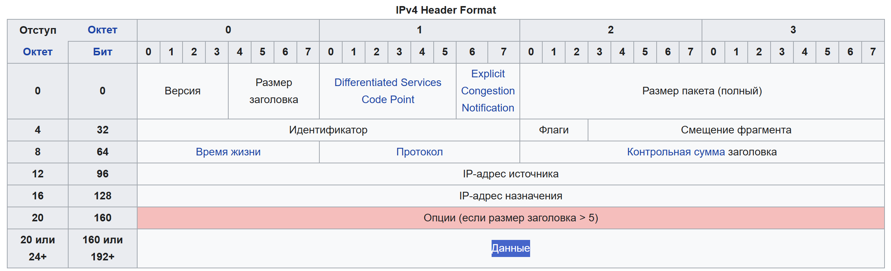

Протоколы

# Сетевой протокол
ipv4 - 2^32 всего вариантов ip (4 млрд)
(256.256.256.256)

ipv4  ipv6

nat:
идея - у провайдера железка на район которая является выходом во внешнюю сеть, все компьютеры которые подключены они как бы являются внутреннй сетью.
Он выдвает ip внутри сети который делает запрос он самой сети (этой железки)

ipv6 (из за нехватки ip)

ipv4  ipv6 несовместимы

2 лек
container registry

rpc rest

grpc
proto buf

grpc работает поверз http2
grpc быстрее
исользуется для взаимодействия внутренний микросервисов

http более красивое api использщуется для взаисмодействия с внешними сервисами

асинхронное взаимодействие: broker
msg queue -  ribbit mq
отказоустойчивая система
балансировка задач между worker-ами

kafka
широковещание broadcast 

nginx - балансировщик нагрузки между разыми обработчиками(сервисами)
или единая точка входа в backend (прокси)